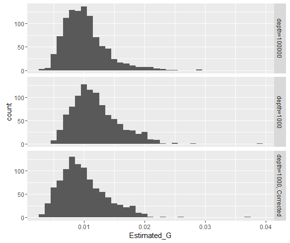

# diversit-tag


R code for investigating changes in diversity for a massively multi-allelic system. 


## The Model


## Data Format

Raw data should be in files with the first column a set of tags, labelled tag,
other columns then give the counts in a set of tissues/cells.  Example 
data sets are given in the files `/data/example1.txt` and `/data/example2.txt`.

The first few lines of `example1.txt` look like


            tag            |  Pop1_A | Pop1_B | Pop1_C 
---------------------------|---------|--------|--------
AAATCACGATGGAAATTGGTTAAACCC|   765   |   61   |     75   
AAATCATGATGCAAAACGGTTCAACAT|   387   |  154   |    156   
AAATCCCGATGCAAACTGGTACAACTC|   1849  |17374   |     20   
AAATCCCGATGCAAATCGGTTTAACTC|   2338  |  888   |    403   
AAATCGCGATGCAAAGCGGTTTAACCC|   1213  |  365   |    400   


These can be read into R in the usual way

````
ex1 <- read.table("data/example1.txt", header=TRUE, stringsAsFactors=FALSE)
ex2 <- read.table("data/example2.txt", header=TRUE, stringsAsFactors=FALSE)
```

### Combining data sets

The R function `merge_by_tag` allows you to merge data sets 
together.  Tags that are not present in either of the data sets 
will be given a zero count.

```
source("R/functions.R")
ex <- merge_by_tag(ex1, ex2)
```


## Analysing these data

### Plotting

A simple barplot of these data is providied by the function `plot_tagfreq`. This takes the `n_colours` most frequent
tags across both data sets, sorts by the frequency in the first column, and plots the frequencies.  Tags that are not in the top `n_colours` are labelled grey.

```
plot_tagfreq(ex[, -1],  n_colours=20)
```


### Shared Tags

We can tabulate the sharing of tags by considering when tags 
have been shared between two populations using the basic R `table` command. 
```
table(A=ex$Pop1_A>0, C=ex$Pop1_C>0)
```

This does not distinguish between rare an common alleles.  We can improve this by working with the tag relative frequencies.  Get the frequencies 
`freq` by sweeping out the sum of tags.  * Note that `ex[, -1]` removes 
returns a `data.frame` without the first column of tag names.

```
freq <- sweep(ex[,-1], 2, colSums(ex[, -1]), "/")
rownames(freq) <- ex[,1]

table(A=cut(freq$Pop1_A, c(0,0.0001,0.005,1)),
      C=cut(freq$Pop1_C, c(0,0.0001,0.005,1)))
```

Simple R functions have been added to simplify the analysis of tag sharing.  


### Distances Between Tags

If tags are coded as DNA then the distances between tags can be simply measured by using the `stringdist` library.

```{r}
cat(ex$tag[1], ex$tag[2], sep="\n")
stringdist(ex$tag[1], ex$tag[2])
```

The function `tagdistplot` allows you to get plot the frequencies of 
all the tags vs. the distance from the most frequent tag (in addition those 
tags that are 1 step away from the 2nd, 3rd, ... , `howmany`) tags are colour 
coded.  This allows you to see how 1-step errors are a major 
reason for low frequency variants in some runs.

```
tagdistplot(ex$tag, freq$Pop1_A, howmany=4)
```


We can see how there is a cluster of tags that are a single step 
away from the most frequent tag.

## Estimating Nei's G

### Theory

#### Drift from equal frequencies

In the case of the first transplant a number of tags are selected from 
a pool with equal frequencies and then we observe the number of counts 
after sequencing. 

$$
\hat{G} = k/(k-1)  \sum_i (p_i-1/k)^2,
$$
where k is the number of tags, and $p_i$ is the frequency of the $i$th tag. 

#### Drift from baseline

We assume that the counts we see are a representation of an underlying
tag frequency distribution that is observed with error (we assume that 
the counts are poisson distributed with mean equal to $n*p_i$ where $n$
is the total coverage and $p_i$ is the frequency of tag $i$) then, we can 
estimate $G$ by combining over all alleles

$$
\hat{G} = \frac{\sum_i (p_i-b_i)^2}{\sum_i b_i(1-b_i)}
$$

This is practically independent of the poisson error if the 
depth of coverage is high enough.  If the depth is lower then we
can correct 

### R Functions

Estimate Nei's G using the function `estimate_G`.  This can take five parameters.

* `count`. A vector of tag counts.
* `baseline_count`.  The second (if present) is a vector of tag counts, of the same length of `count` which gives the tag counts in a baseline population.  If this is not 
present then an equal frequency in the baseline is assumed.
* The third (called `min_count`) is a filter on the tags.  If any tag has a count of less
than `min_count` in the baseline, then it is not used in the estimate.
* The fourth (`min_p`) is another filter on the tags.  If any tag has a relative frequency of less than `min_p` in the baseline then it is not used in the estimates.
* A Final option is `corrected`.  By default it is `FALSE`, but for low overall 
count it corrects for variability caused by low numbers of tags.

```{r}
estimate_G(ex$Pop1_A)
estimate_G(ex$Pop1_A, ex$Pop2_A, min_p=0.0001)
estimate_G(ex$Pop2_C, ex$Pop1_A, min_p=0.0001)
estimate_G(ex$Pop2_C, ex$Pop1_A, min_count=100)
```

#### Performance of Estimator

We can test the performance of this estimator by comparing with simulated data.  We can see that the performace of the corrected estimator is better for analysis with low total depth.

```{r}
Estimated_G <- numeric(3000)
for (i in 1:1000) {
   aa <- simulate_drifttags(1000, 100000, drift_G=0.01)
   Estimated_G[i] <- estimate_G(aa$count, aa$background_count)
}
for (i in 1:1000) {
   aa <- simulate_drifttags(1000, 1000, drift_G=0.01)
   Estimated_G[1000+i] <- estimate_G(aa$count, aa$background_count)
   Estimated_G[2000+i] <- estimate_G(aa$count, aa$background_count, corrected=TRUE)
}
d <- data.frame(Estimated_G, depth=gl(3,1000,labels=c("depth=100000", "depth=1000", "depth=1000, Corrected")))
ggplot(d, aes(x=Estimated_G)) + geom_histogram(binwidth=0.001) + facet_grid(depth~.)
```
```
round(tapply(d$Estimated_G, d$depth, mean), 4)
         depth=100000            depth=1000 depth=1000, Corrected 
               0.0101                0.0119                0.0099 
```




